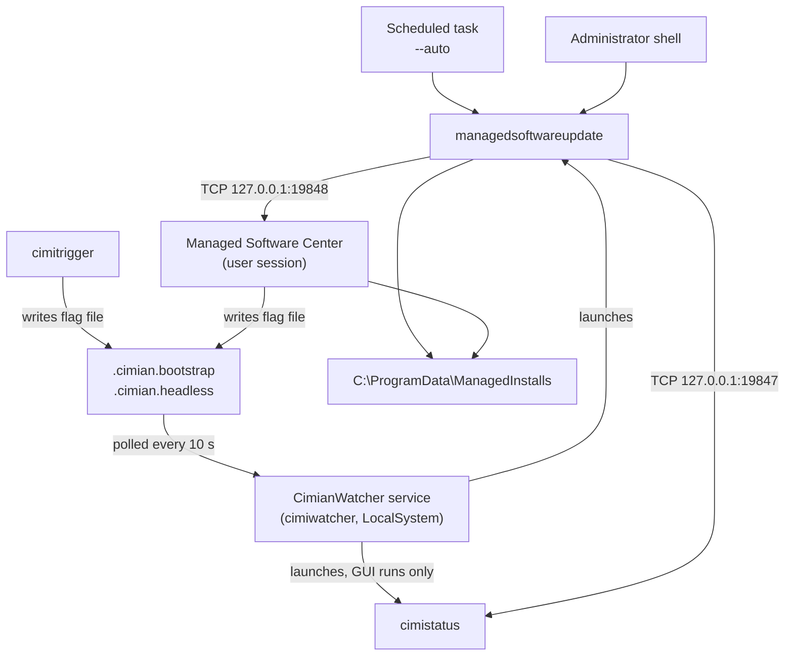

# Architecture

This page describes how the Cimian source is organised and how the shipped
components behave at runtime. It is written for someone about to make their first
change to the codebase: where the code for a given tool lives, which project
produces which executable, what the shared libraries are responsible for, and how
the client, the watcher service, the trigger and the two graphical applications
reach each other on a running machine.

For building and testing what you change, see [Building Cimian](Building-Cimian).

## Repository layout

| Directory | Contents |
|---|---|
| `cli/` | One directory per command-line executable. Each is its own project. |
| `gui/` | The two graphical applications, `CimianStatus` and `ManagedSoftwareCenter`. |
| `shared/` | Class libraries shared by the tools: `core`, `engine`, `infrastructure`, `import`. |
| `tests/` | The xUnit test project, hand-authored fixtures, the smoke test, and the container test harness. |
| `build/` | Packaging inputs: MSI support scripts, install and uninstall custom-action scripts, the NuGet spec templates. |
| `build.ps1` | The build and packaging orchestrator. |
| `Directory.Build.props` | Properties applied to every project: target framework, publish settings, shared package references. |
| `CimianTools.sln` | The solution. |
| `wiki/` | The source of this wiki. |

`cli/cimipkg` is a git submodule, not part of this repository's own history. Clone
with `--recurse-submodules` or the solution will not restore.

## Projects and the binaries they produce

Every command-line project sets an `AssemblyName` in lower case that matches the
command you type, so the project directory, the assembly and the installed
executable all share a name.

| Project | Produces |
|---|---|
| `cli/managedsoftwareupdate` | `managedsoftwareupdate.exe` |
| `cli/cimiwatcher` | `cimiwatcher.exe` |
| `cli/cimitrigger` | `cimitrigger.exe` |
| `cli/cimiimport` | `cimiimport.exe` |
| `cli/cimipkg` | `cimipkg.exe` (submodule) |
| `cli/makecatalogs` | `makecatalogs.exe` |
| `cli/makepkginfo` | `makepkginfo.exe` |
| `cli/manifestutil` | `manifestutil.exe` |
| `cli/repoclean` | `repoclean.exe` |
| `gui/CimianStatus` | `cimistatus.exe` |
| `gui/ManagedSoftwareCenter` | `Managed Software Center.exe` |

Two projects declare the assembly name `cimistatus`: the WPF application under
`gui/CimianStatus`, and a small status-reporting console program under
`cli/cimistatus`. `build.ps1` maps the tool name `cimistatus` to `gui/CimianStatus`,
so the WPF application is what ships as
`C:\Program Files\Cimian\cimistatus.exe`. `cli/cimistatus` is compiled by a
solution build but is never published into a release. Do not assume a change there
reaches an installed machine.

Every project targets `net10.0-windows` and publishes self-contained, so a managed
machine needs no .NET runtime installed. The two graphical projects target
`net10.0-windows10.0.19041.0` with a platform minimum of 10.0.17763.0. There is no
cross-platform target and no x86 runtime identifier; the only architectures are
`win-x64` and `win-arm64`.

## The shared libraries

**`shared/core` — `Cimian.Core`.** The library everything else references. It owns:

- `CimianPaths`, the single definition of every on-disk location the tools use —
  `C:\ProgramData\ManagedInstalls` and its subdirectories, `C:\Program Files\Cimian`,
  the trigger flag files, `Config.yaml`, `InstallInfo.yaml`, `SelfServeManifest.yaml`.
  Never hardcode one of these paths in a tool; add or use a constant here.
- `Models/` — the deserialised shapes of catalogs, manifests, `InstallInfo.yaml`,
  system facts, install triggers, installation-state results, reporting records and
  the status reason codes.
- `Version/VersionService` — version normalisation and comparison, described on
  [Version Comparisons](Version-Comparisons).
- `Services/` — `LoopGuard` (install-loop suppression, see
  [Install Loop Prevention](Install-Loop-Prevention)), `SessionLogger` (the
  day-nested session log tree described on [Logging](Logging)), `DataExporter`
  (the reporting export described on [Reporting Data Contract](Reporting-Data-Contract)),
  `SelfUpdateService` (staging and applying Cimian's own MSI, see
  [Updating Cimian](Updating-Cimian)), `SelfServiceManifestService`,
  `BootstrapArgsBuilder`, `ConsoleLogger`, `YamlUtils`, and the usage-data
  abstraction behind stale-software removal.

`Cimian.Core` grants `InternalsVisibleTo` to `Cimian.Tests`, so internal types are
testable without being public API.

**`shared/engine` — `Cimian.Engine`.** The predicate engine only: the parser and
evaluator for the conditional expressions used by `conditional_items` and by
pkgsinfo conditions. See [Conditional Items](Conditional-Items).

**`shared/infrastructure` — `Cimian.Infrastructure`.** Machine inspection:
`SystemFactsCollector` gathers the facts a predicate can test (hardware, OS, domain
and Entra join state, MDM enrollment), and `GpuIdentity` resolves a display
adapter's PCI hardware ID so a driver predicate still works when no vendor driver
is bound.

**`shared/import` — `Cimian.Import`.** The installer-import workflow — metadata
extraction, prompting, pkgsinfo generation, repository placement — factored out of
`cimiimport` so a graphical admin tool can host the same code. It is a library, and
it is the one shared project not listed in `CimianTools.sln`; it builds because
`cli/cimiimport` references it.

The dependency direction is strictly one way: `Core` depends on nothing of Cimian's,
`Infrastructure` and `Import` depend on `Core`, `Engine` depends on `Core` and
`Infrastructure`, and the tools depend on some subset of those.

## Shared services the tools have in common

- **Paths and state.** Every tool resolves state through `CimianPaths`. All runtime
  data lives under `C:\ProgramData\ManagedInstalls`; nothing writable lives in
  Program Files.
- **Configuration.** `Config.yaml` is read with PascalCase keys, then overridden by
  four values under `HKLM\SOFTWARE\Policies\Cimian`. See
  [Client Configuration](Client-Configuration).
- **YAML.** One serializer library, YamlDotNet, across every tool.
- **Logging.** Serilog with console, file and event-log sinks is referenced
  repository-wide; the session log layout is produced by `SessionLogger`.
- **Argument parsing is not uniform.** `managedsoftwareupdate` uses
  CommandLineParser with `[Option]` attributes; every other tool uses
  System.CommandLine. That is why flag spellings differ between tools, as
  [Command-Line Tools](Command-Line-Tools) notes. Match the parser already in the
  tool you are editing rather than introducing a third.

`Cimian.Infrastructure` also carries package references to the AWS S3 and Azure
Blob SDKs and to Polly. No source file in the repository uses any of them, and the
cloud and proxy configuration classes in `Cimian.Core.Models.Configuration` are
never instantiated. Treat all of that as dead weight, not as a supported feature.

## How the pieces talk at runtime

Five programs are involved on a managed machine.

`managedsoftwareupdate` is the engine. It does the work and holds no server of its
own. It is started three ways: by the hourly scheduled task with `--auto`, by the
`CimianWatcher` service when a trigger flag file appears, or by an administrator
typing it in an elevated shell.

`cimiwatcher` runs as the `CimianWatcher` Windows service under LocalSystem. It
polls `C:\ProgramData\ManagedInstalls` every ten seconds for two flag files —
`.cimian.bootstrap` for a run with a visible GUI, `.cimian.headless` for a silent
one. It reads an optional argument line out of the file, **deletes the file**, then
launches `managedsoftwareupdate`, and for the GUI case also launches
`cimistatus.exe`. An in-process flag serialises runs; if a run is already active the
flag file is left on disk and picked up on the next poll. Because the file is
deleted before the engine starts, a triggered run does not see itself as being in
bootstrap mode. The same executable also manages its own service registration:
`cimiwatcher install`, `remove`, `start`, `stop`, `status`, plus `debug` to run the
watcher in the console and `service` for the service control manager itself.

`cimitrigger` writes those same flag files from the command line — `cimitrigger gui`
and `cimitrigger headless` — and falls back to direct elevation if the service does
not consume the file.

`cimistatus` (the WPF window) and `Managed Software Center` (the WinUI 3 self-service
portal) are the two graphical applications. Managed Software Center also writes
`.cimian.bootstrap` to start work, which is how a standard user gets an elevated run
without a UAC prompt: the SYSTEM-context service does the launching.

### Status IPC

Progress reporting is a loopback TCP connection carrying newline-delimited UTF-8
JSON, one message object per line. The direction is the opposite of what the names
suggest: **the graphical application is the server and `managedsoftwareupdate` is
the client.**

| Port | Listener | Client |
|---|---|---|
| 19847 | `cimistatus` | `managedsoftwareupdate` started without `--status-port` |
| 19848 | `Managed Software Center` | `managedsoftwareupdate` started with `--status-port 19848` |

Both listeners bind `IPAddress.Loopback` only, so nothing is reachable off the
machine. The engine connects to `127.0.0.1` on the port given by `--status-port`,
which defaults to 19847. Managed Software Center appends `--status-port 19848` to
every argument line it writes into the trigger file, so its runs report to it rather
than to the login-window window. The split exists because a locked machine can be
showing `cimistatus` in the login session while a user session runs Managed Software
Center; one shared port made the two collide. Managed Software Center retries the
bind every two seconds if the port is in use.

The connection is duplex. The engine sends `statusMessage`, `detailMessage`,
`percentProgress`, `displayLog`, `itemStatus` and `quit`; the graphical application
can send `{"type":"stop"}` back, which is the only command the engine acts on — it
cancels the run. `cimistatus` does not understand `itemStatus`, so per-item
lifecycle detail appears only in Managed Software Center. Neither `quit` nor a
dropped connection closes `cimistatus`; it pins progress at 100% and waits for the
user.

Managed Software Center also contains a named-pipe client for a pipe called
`CimianProgress`. It is not registered in dependency injection and nothing
references it. The pipe does not exist at runtime; ignore it.

### File-based coupling

Everything else the components share, they share through files under
`C:\ProgramData\ManagedInstalls`:

- `.cimian.bootstrap` / `.cimian.headless` — trigger files, written by
  `cimitrigger` or Managed Software Center, consumed and deleted by the watcher.
- `.cimian.selfupdate` — marks a staged update of Cimian itself.
- `InstallInfo.yaml` — the engine's view of pending work; Managed Software Center
  reads it and watches it for changes to detect a run finishing.
- `SelfServeManifest.yaml` — the user's self-service selections, written by
  Managed Software Center and read by the engine.
- `logs/` and `reports/` — session logs and the reporting exports.

## Versioning of assemblies

`Directory.Build.props` stamps `AssemblyVersion`, `FileVersion` and `Version` with
the current time in `yyyy.MM.dd.HHmm` form, evaluated per project as it compiles.
`build.ps1` overrides all three with one version for the whole build, so a
`build.ps1` build is internally consistent while a bare `dotnet build` can produce
projects whose versions differ by a minute. If you are comparing a tool's
`--version` output across the set, build through `build.ps1`.

## Making your first change

Locate the behaviour first. Client-side decisions about what to install belong in
`cli/managedsoftwareupdate/Services`; conditional expression evaluation belongs in
`shared/engine`; anything about a fact a condition can test belongs in
`shared/infrastructure`; anything about a path, a model shape or a cross-tool
service belongs in `shared/core`. Repository-side behaviour belongs in the relevant
`cli/` tool, except for the import workflow, which lives in `shared/import`.

Then add a test in `tests/`, build, and run the suite — see
[Building Cimian](Building-Cimian) — and read [Contributing](Contributing) for the
branch and pull request conventions.

## See also

- [Building Cimian](Building-Cimian)
- [Release Process](Release-Process)
- [Contributing](Contributing)
- [Command-Line Tools](Command-Line-Tools)
- [How Cimian Runs](How-Cimian-Runs)
- [cimiwatcher](cimiwatcher)
- [cimitrigger](cimitrigger)
- [cimistatus](cimistatus)
- [Managed Software Center](Managed-Software-Center)
- [Client Configuration](Client-Configuration)
- [Logging](Logging)
